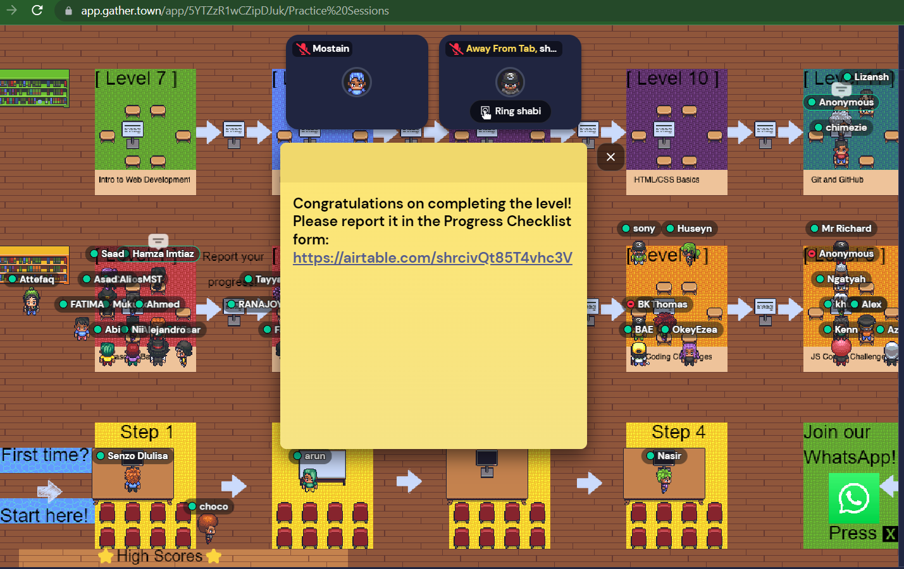

# Microverse Practice Repo

# [Level-1 (JavaScript Basics 1)](https://docs.google.com/presentation/d/1NOZmvjmX7Cy97cH_JeZ3yuIaIKTEvV5nMuXRMrIcCDA/edit?usp=sharing)
* [Presentation](https://docs.google.com/presentation/d/1NOZmvjmX7Cy97cH_JeZ3yuIaIKTEvV5nMuXRMrIcCDA/edit?usp=sharing)

## Exercise 1
1. Created an replit account with the username of [https://replit.com/@mateors](mateors)
2. Created am empty Node.js project. [Javascript](https://replit.com/@mateors/Javascript#index.js)

## Variable
[Why are variables useful?](https://youtu.be/IMDApd-aRoc)

## Declaring and displaying variables

## Exercise 2

```js
let myname="Md Mostain";
console.log(myname);
```

## Data Types
[Data types in Javascript](https://youtu.be/odr19LorSZk)

```js
let myname="Mostain"; //String
let height=154;  //Numerica
let isAdult=true; //Boolean
```
### [Undefined vs Null in Javascript](https://flexiple.com/javascript/undefined-vs-null-javascript)
In JavaScript, there are two special types of values – undefined and null. It is crucial for a beginner to understand the differences between them (null and undefined) and when to use what.

### Introduction to undefined and null values
Many times we often get confused on what the difference between UNDEFINED and NULL is. Simply put, undefined means a variable has been declared but has not yet been assigned a value. undefined is a type by itself (undefined). Unassigned variables are initialized by JavaScript with a default value of undefined.

```js
//demonstrating usage of undefined in javascript
var n;

console.log(n);

//undefined
```
 > The variable by default is assigned a value of undefined.


### Undefined vs null - the differences

1. Data types:
```js
console.log(typeof undefined); //“undefined”
console.log(typeof null); //“object”
```
2. In arithmetic operations
When used in arithmetic operations, undefined will result in NaN (not a number), whereas null will be converted to 0 behind the screens.

```js

// demonstration of arithmetic operations using undefined and null
console.log(undefined + 1); // NaN

console.log(null + 1); // 1
```

3. Undefined and null are falsy
When used in conditional logic both undefined and null will return false.
```js
console.log(!!undefined); //false

console.log(!!null); //false
```

4. Comparing undefined and null
Let’s see what happens when you compare undefined and null using the JavaScript equality operators.

```js
// comparing undefined and null
console.log(undefined == null);//true

console.log(undefined === null);//false
```
As you can see, when the equality operator is used it compares only the values. Both undefined and null are falsy by default. So == returns true.

But when we use the strict equality operator (===) which checks both type and value, since undefined and null are of different types (from the typeof Operator section), the strict equality operator returns false.

## Exercise 4
```js
let greeting = "Hello my name is";
let myname = "Mostain";
let str = "As I have"
let apples = 10;
let end= "apples";
console.log(greeting, myname, str,apples, end);
```

## Modifying variables
```js
//String type concatenation
let name = "Mostain";
name = name + " Billah";
console.log(name); //Mostain Billah
//or
name += " Billah";
console.log(name); //Mostain Billah

//Numeric type concatenation
let apples = 10;
apples = apples +5;
console.log(apples); //15

//or
apples +=5;
console.log(apples); //15
```

## Exercise 6
```js
let greeting = "Hello my name is";
let myname = "Mostain";
let lastname = "Billah";
let str = "As I have"
let apples = 10;
apples *= 5;
let end= "apples";
console.log(greeting, myname,lastname, str,apples, end);
```

## Final Assesment

### Storing Values with the Assignment Operator
In JavaScript, you can store a value in a variable with the assignment operator (=).
```js
myVariable = 5;
```
[This assigns the Number value 5 to myVariable.](https://www.freecodecamp.org/learn/javascript-algorithms-and-data-structures/basic-javascript/storing-values-with-the-assignment-operator)

If there are any calculations to the right of the = operator, those are performed before the value is assigned to the variable on the left of the operator.

```js
var myVar;
myVar = 5;
```
First, this code creates a variable named myVar. Then, the code assigns 5 to myVar. Now, if myVar appears again in the code, the program will treat it as if it is 5.

### [Assigning the Value of One Variable to Another](https://www.freecodecamp.org/learn/javascript-algorithms-and-data-structures/basic-javascript/assigning-the-value-of-one-variable-to-another)
After a value is assigned to a variable using the assignment operator, you can assign the value of that variable to another variable using the assignment operator.
```js
var myVar;
myVar = 5;
var myNum;
myNum = myVar;
```
### Above code explanation
* The above declares a myVar variable with no value 
* then assigns it the value 5. 
* Next, a variable named myNum is declared with no value. 
* Then, the contents of myVar (which is 5) is assigned to the variable myNum. 
* Now, myNum also has the value of 5.

### [Understanding Case Sensitivity in Variables](https://www.freecodecamp.org/learn/javascript-algorithms-and-data-structures/basic-javascript/understanding-case-sensitivity-in-variables)

In JavaScript all variables and function names are case sensitive. This means that capitalization matters.

`MYVAR` is not the same as `MyVar` nor `myvar`. It is possible to have multiple distinct variables with the same name but different casing. It is strongly recommended that for the sake of clarity, you do not use this language feature.

#### Best Practice
Write variable names in JavaScript in camelCase. In camelCase, multi-word variable names have the first word in lowercase and the first letter of each subsequent word is capitalized.

#### Examples:
```js
var someVariable;
var anotherVariableName;
var thisVariableNameIsSoLong;
```

```js
let arr=[];

for (let i=3; i<=12; i++ ){
  arr.push(i);
  console.log(arr);
}
```

# [Level-2](https://docs.google.com/presentation/d/1aagkWAfDdFYWZul_WnhdlXicHHD3WNXZUZb13UyGijo/edit?usp=sharing)

## How to use bubbles to do teamwork
We have created a whatsapp group of 7 members, the purpose of this group is to study and practice code together in a collaborative way.

### mob programming in bubbles
One become a driver and the rest are navigators from the newly form bubbles/team
driver will  share his/her screen and code with the help of navigators.

## Why teamwork is so important?
* Most of your time at Microverse will be spent doing teamwork with others, and doing teamwork in this level will prepare you for that.
* Teamwork will give you the opportunity to improve your coding communication skills.
* Being able to communicate your thought process while coding is essential at real-world tech job interviews.

> so teamwork helps to improve our coding communication skills as well as thinking process.

To get recommendation from the microverse representitive we need to form a team and work together and participate all the event specially hackathon on wednesday at 8pm. Remember only participant will get recommendation to join microverse program.


## Basic aritmetics in JavaScript

### Exercise 1
```js
let A= 4 + 7;
let B = 5 * 9;
let C= B/A;
console.log(C); //4.090909090909091
```

### Why if-then-else statements matter
Like real world in programming we need to take decisions and `if`, `else if`, `else` this are the keywords help us to take decision or select a specific block of code in our program and execute.

### Switch case syntax
```js


let steps=0;

//if else
if (steps==0){
  console.log("You have not started yet!, you are at steps 0");
}else if(steps==1){
  console.log("You are at steps 1");
}else{
  console.log("You need help to get started?");
}

//same but using switch case
switch(steps){
  case 0:
    console.log("You have not started yet!, you are at steps 0");
    break;
    
  case 1:
    console.log("You are at steps 1");
    break;

  default:
    console.log("You need help to get started?");
}
//above line of code will output
//You have not started yet!, you are at steps 0
```
* [Which one to pick? if-else or switch-case?](https://dasha.ai/en-us/blog/javascript-if-else-or-switch-case)


## Excersise 2
```js 
let X = 32;

if (X==9){
  console.log("True");
}else{
  console.log("False");
}

let Y = "Green";
if (Y=="Blue"){
  console.log("Blue detected!");

} else if(Y=="Green"){
   console.log("Green detected!");

}else{
  console.log("No green or blue detected!");
}
```

## Comparison Operators
* `==`	equal to
* `===`	equal value and equal type
* `!=`	not equal
* `!==`	not equal value or not equal type
* `>`	greater than
* `<`	less than
* `>=`	greater than or equal to
* `<=`	less than or equal to

```js
if (age < 18) text = "Too young to buy alcohol";
```

## Logical Operators
* `&&` and -> (x < 10 && y > 1) is true
* `||` or
* `!`	 not

## Conditional (Ternary) Operator
JavaScript also contains a conditional operator that assigns a value to a variable based on some condition.

### Syntax
> variablename = (condition) ? value1:value2 
```js
let voteable = (age < 18) ? "Too young":"Old enough";
console.log(voteable);
```

### Make sure that you understand the difference between:
* `==` and `===`
* `!=` and `!==`

> Double equals (`==`) is a comparison operator, which transforms the operands having the same type before comparison.

> `===` (Triple equals) is a strict equality comparison operator in JavaScript

## Exercise 3
```js
let n = 71; //50
if ( n > 45 ){
   if ( n < 65 ){
    console.log(n);
   }
}
```

## While loop
### Exercise 4
```js
let i = 2;
while(i<=9){
 console.log(i);
 i++;
}
```

## For loop
### Exercise 5
```js
for(let i=7; i<13; i++){
  console.log(i);
}
```

## Data Structure - Array
### Exercise 6
```js
let numbers = [8,9,10,11,12,13,14,15];
console.log(numbers[3]); //4th value
console.log(numbers);
```

## Combining arrays, loops and if-then-else
### Exercise 7 (Google Slide 23)
```js
let numbers = [1,2,3,4,5,6,7,8,9,10];
let size=numbers.length;

for(let i=0; i<size; i++){
  //if(i>4){
    console.log(i);
  //}
}
```

## JavaScript coding challenges
Google slide 26 & 27

* [Understanding Boolean Values](https://www.freecodecamp.org/learn/javascript-algorithms-and-data-structures/basic-javascript/understanding-boolean-values)
* [Use Conditional Logic with If Statements](https://www.freecodecamp.org/learn/javascript-algorithms-and-data-structures/basic-javascript/use-conditional-logic-with-if-statements)
```js
function trueOrFalse(wasThatTrue) {
    // Only change code below this line
  if(wasThatTrue){
    return "Yes, that was true";
  }else{
    return "No, that was false";
  }
    // Only change code above this line
}
```
* [Comparison with the Equality Operator](https://www.freecodecamp.org/learn/javascript-algorithms-and-data-structures/basic-javascript/comparison-with-the-equality-operator)

In order for JavaScript to compare two different data types (for example, `numbers` and `strings`), it must convert one type to another. This is known as Type Coercion. Once it does, however, it can compare terms as follows:

```js
1   ==  1  // true
1   ==  2  // false
1   == '1' // true
"3" ==  3  // true
```
```js
// Setup
function testEqual(val) {
  if (val==12) { // Change this line
    return "Equal";
  }
  return "Not Equal";
}

testEqual(10);
```
* [Comparison with the Inequality Operator](https://www.freecodecamp.org/learn/javascript-algorithms-and-data-structures/basic-javascript/comparison-with-the-inequality-operator)
* [Comparison with the Greater Than Or Equal To Operator](https://www.freecodecamp.org/learn/javascript-algorithms-and-data-structures/basic-javascript/comparison-with-the-greater-than-or-equal-to-operator)
```js
function testGreaterOrEqual(val) {

  if (val>=20) {  // Change this line
    return "20 or Over";
  }
  if (val>=10) {  // Change this line
    return "10 or Over";
  }
  return "Less than 10";
}

testGreaterOrEqual(10);
```
*[Store Multiple Values in one Variable using JavaScript Arrays](https://www.freecodecamp.org/learn/javascript-algorithms-and-data-structures/basic-javascript/store-multiple-values-in-one-variable-using-javascript-arrays)
```js
// Only change code below this line
const myArray = ["Mostain", 38];
```
* [Access Array Data with Indexes](https://www.freecodecamp.org/learn/javascript-algorithms-and-data-structures/basic-javascript/access-array-data-with-indexes)
```js
const array = [50, 60, 70];
console.log(array[0]);
const data = array[1];

//Create a variable called myData and set it to equal the first value of myArray using bracket notation.
const myArray = [50, 60, 70];
let myData = myArray[0];
```

* [Modify Array Data With Indexes](https://www.freecodecamp.org/learn/javascript-algorithms-and-data-structures/basic-javascript/modify-array-data-with-indexes)
Unlike strings, the entries of arrays are mutable and can be changed freely, even if the array was declared with const.
### Example
```js
const ourArray = [50, 40, 30];
ourArray[0] = 15;
ourArray now has the value [15, 40, 30].

// Setup
const myArray = [18, 64, 99];

// Only change code below this line
myArray[0]=45;
```
* [Iterate with JavaScript While Loops](https://www.freecodecamp.org/learn/javascript-algorithms-and-data-structures/basic-javascript/iterate-with-javascript-while-loops)
You can run the same code multiple times by using a loop.

The first type of loop we will learn is called a while loop because it runs while a specified condition is true and stops once that condition is no longer true.

```js
const ourArray = [];
let i = 0;

while (i < 5) {
  ourArray.push(i);
  i++;
}

//Add the numbers 5 through 0 (inclusive) in descending order to myArray using a while loop.
// Setup
const myArray = [];
// Only change code below this line
let i=5;
while(i>=0){
  myArray.push(i);
  i--;
}
console.log(myArray);
```
* [Iterate with JavaScript For Loops](https://www.freecodecamp.org/learn/javascript-algorithms-and-data-structures/basic-javascript/iterate-with-javascript-for-loops)
You can run the same code multiple times by using a loop.

The most common type of JavaScript loop is called a for loop because it runs for a specific number of times.

For loops are declared with three optional expressions separated by semicolons:

`for (a; b; c)`, where `a` is the initialization statement, `b` is the condition statement, and `c` is the final expression.
```js
// Setup
const myArray = [];

// Only change code below this line
for(let i=1; i<=5; i++){
  myArray.push(i);
}
```
* [Count Backwards With a For Loop](https://www.freecodecamp.org/learn/javascript-algorithms-and-data-structures/basic-javascript/count-backwards-with-a-for-loop)
A for loop can also count backwards, so long as we can define the right conditions.

In order to decrement by two each iteration, we'll need to change our initialization, condition, and final expression.

We'll start at `i = 10` and loop while `i > 0`. We'll decrement `i` by 2 each loop with `i -= 2`.
```js
const ourArray = [];

for (let i = 10; i > 0; i -= 2) {
  ourArray.push(i);
}

//Push the odd numbers from 9 through 1 to myArray using a for loop.
// Setup
const myArray = [];
// Only change code below this line
for(let i=9; i>0; i-=2){
  myArray.push(i);
}
```
* [Iterate Through an Array with a For Loop](https://www.freecodecamp.org/learn/javascript-algorithms-and-data-structures/basic-javascript/iterate-through-an-array-with-a-for-loop)
```js
//Declare and initialize a variable total to 0. Use a for loop to add the value of each element of the myArr array to total.

// Setup
const myArr = [2, 3, 4, 5, 6];

// Only change code below this line
let total=0;
for(let i=0; i<myArr.length; i++){
  total+=myArr[i];
  //console.log(total);
}
```

## Recommendation for doing teamwork
We did some teamwork in this level 2 so we are a valid candidate for asking the recommendation, please submit the recommendation form https://airtable.com/shrDs5hEGXsGTh8OT


## Don't forget to submit progress report
After completeing every level we must submit our progress report using the gather board.


[Progress report form](https://airtable.com/shrcivQt85T4vhc3V)


## [Level-3](https://docs.google.com/presentation/d/15-Db3kK2SM55dxFxJWoTP8MiRI40rVDTUVIumV4tfp4/edit?usp=sharing)

### Tweaking `for` loops

### Exercise 1
```js

for(let i=102; i>=27; i-=3){
  console.log(i);
}

```

### Array operations
```js
let arr = ["Apple", "Banana", 10, 20, 50];

//push to arr = add to the ending
arr.push("Orange");
console.log(arr);

//pop from arr = remove from the ending
let popped=arr.pop();
console.log(popped);
console.log(arr);

//shifting = remove from the beginning
let shifted=arr.shift();
console.log(shifted, arr);

//add from the beginning
arr.unshift(50);
console.log(arr);

//remove multiple element from array
let spliced=arr.splice(1,2);
console.log(spliced, arr);

//copy section of an array
let copys=arr.slice(0,2);
console.log(copys);
```
### Exercise 2
```js
let arr = [];

for(let i=3; i<=12; i++){
  arr.push(i);
}
console.log(arr);
```

## Basic logical operators
### Exercise 3
```js
let arr =[3, 10, 9, 5, 2, 11, 7, 15, 12, 4, 1, 13, 6, 14, 8];
for(let i=0; i<arr.length; i++){
  if (arr[i] >=3 && arr[i] <=7){
    console.log(arr[i]);
  }
}
//--------
function testLogicalAnd(val) {
  // Only change code below this line
  if (val >=25 && val <=50) {
      return "Yes";
  }
  // Only change code above this line
  return "No";
}
testLogicalAnd(10);

function testLogicalOr(val) {
  // Only change code below this line
  if (val<10 || val>20) {
    return "Outside";
  }
  // Only change code above this line
  return "Inside";
}
testLogicalOr(15);
```

## Exercise 4
```js
let arr =[3, 10, 9, 5, 2, 11, 7, 15, 12, 4, 1, 13, 6, 14, 8];
for(let i=0; i<arr.length; i++){
  if (arr[i]<3 || arr[i]>7){
    console.log(arr[i]);
  }
}
```
## String truncation
### Exercise 5
```js
let name="Microverse";
console.log(name.substring(0,5));
console.log(name.substring(0,5));
```

## Exercise 6
```js
let arr= [1,2,3,4,5,6,7,8,9,10,13];
let number=13;

for(let x of arr){
  if(x==number){
    console.log("Found it!");
  }else{
    console.log("Not found");
  }
}
```

## Exercise 7
```js
let numbers= [1,2,3,4,5,6,7,8,9,10];
let arr= [];

for(let i=0; i<numbers.length; i++){
 if(numbers[i]>=4 && numbers[i]<=9){
  arr.push(numbers[i]);
 }
}
console.log(arr);

```

### Exercise 8
```js
let arr = [ [1, 2, 3], [4, 5, 6], [7, 8, 9] ];
let size=arr.length;

for(let i=size-1; i>=0; i--){

  //console.log(arr[i]);
  let sa=arr[i];
  for(let j=sa.length-1; j>=0; j--){
    console.log(sa[j]);
  }
}
```


### Exercise 9
```js
let bigarr= [];
let extc=9;

for(let i=0; i<3; i++){

  let little=[];
  for(let j=0; j<3; j++){
    little.push(extc);
    extc--;
  }
 bigarr.push(little);
}
console.log(bigarr);
```

## Function arguments
* less code or no code repetition
* arguments

### Exercise 10
```js
function multiplier(){
  let a=5;
  let b=6;
  console.log(a*b);
}

function greet(name){
  console.log(`Hello ${name}`);
}
```
> How to use return to produce the output of a function

### Exercise 11
```js

function myFunc(arr){
  let output = [];
  for(let x of arr){
     output.push(x*5);
  }
  return output;
}

let out=myFunc([1,5,10]);
console.log(out);
```


* [Reversing and translating arrays with functions](https://www.youtube.com/watch?v=UAI7jTJg3OM&t=1s)

### Exercise 12
```js

function reverse(arr){
  
 let output = [];
 for (let i= arr.length-1; i>=0; i--){
   output.push(arr[i])
 }
 return output;
}
console.log(reverse([1,2,3]));

function revTran(arr){
  let output=[];
  for(let i=arr.length-1; i>=0; i--){
    output.push(arr[i])
  }

  let result=[];
  for(let i=0; i<output.length; i++){
   
    if(output[i]==1){
       result.push("one");
    }
    if(output[i]==2){
       result.push("two");
    }
    if(output[i]==3){
       result.push("three");
    }
    if(output[i]==4){
       result.push("four");
    }
  }
  return result;
}
//console.log(revTran([1,2,3,4])); 
//console.log(revTran([4,1,1,2])); //
console.log(revTran([1,2,1,2])); //
```

## [Level-4](https://docs.google.com/presentation/d/1qX08h9muuE-iFb0TlkhbPrV4rmcBjnvpIQRuIQEdFAU/edit?usp=sharing)
Slide 4, Convert Celsius to Fahrenheit 

```js
function convertCtoF(celsius) {
  let fahrenheit;
  fahrenheit=celsius*(9/5)+32;
  return fahrenheit;
} 
console.log(convertCtoF(30));
```

### [Reverse a String](https://www.freecodecamp.org/learn/javascript-algorithms-and-data-structures/basic-algorithm-scripting/reverse-a-string)
slide 8

> How do i turn the string into an array?
There are 4 Ways to Convert String to Character Array in JavaScript.
```js
const string = 'word';
```
1. string.split(''); `console.log(string.split(''));`
2. [...string]; `console.log([...string]);`
3. Array.from(string); `console.log(Array.from(string));`
4. Object.assign([], string); `console.log(Object.assign([],string));`


```js
function reverseString(str){
  let reverse="";
  //read/access each letter from the str variable
  for(let i=str.length-1; i>=0; i--){
    //console.log(str[i]);
    reverse+=str[i];
  }
  return reverse;
}

reverseString("hello");

//Another way using .split() function
function reverseString(str){
  
  let reverse="";
  //let narr=str.split(""); //option 1
  //let narr=[...str]; //option 2
  //let narr=Array.from(str); //option 3
  let narr=Object.assign([], str); //option 4

  //reading each letter from the narr array
  for(let i=narr.length-1; i>=0; i--){
    reverse+=narr[i];
  }
  return reverse;
}
```
### [Factorialize a number](https://www.freecodecamp.org/learn/javascript-algorithms-and-data-structures/basic-algorithm-scripting/factorialize-a-number)
Slide 12, Return the factorial of the provided integer.
Factorials are often represented with the shorthand notation n!
For example: `5! = 1 * 2 * 3 * 4 * 5 = 120`
```js
//Manual factorial calculation
let x = 1;

x *=2;

x *=3;
console.log(x); //3!=6

x *=4;
console.log(x); //4!=24

x *=5;
console.log(x); //5!=120

x *=6;
console.log(x); //6!=720

//Now turn the above idea/concept into a function
//Time Complexity: O(n)
function factorialize(num) {
  let result=1;
  for(let i=2; i<=num; i++){
   result *= i;
   //console.log(result);
  }
  return result;
}

//Time Complexity: O(n)
function recursiveFactorial(num){

  //base case
  if (num==1 || num==0){
    return 1;
  }
  //recursive case
  num=num*rfactor(num-1);
  return num;
}

```


### [Truncate a String](https://www.freecodecamp.org/learn/javascript-algorithms-and-data-structures/basic-algorithm-scripting/truncate-a-string)
Slide 16, Truncate a string (first argument) if it is longer than the given maximum string length (second argument). Return the truncated string with a `...` ending.

```js
function truncateString(str, num) {
  let size=str.length;
  str=str.substring(0,num);
  if (size>num){
    str=str+"...";
  }
  return str;
}
```

### [Where do I Belong](https://www.freecodecamp.org/learn/javascript-algorithms-and-data-structures/basic-algorithm-scripting/where-do-i-belong)

* [How javascript array sorting works?](https://www.javascripttutorial.net/javascript-array-sort/)
```js
let arr = [5, 2, 10, 4, 3, 1];
console.log(arr);
arr.sort(function(a, b) {

  if (a > b) { //first argument is greater than second
    return 1; //positive
  }
  if (a < b) { //first argument is less than second
    return -1; //negative
  }
  return 0; //a==b, both are equal so zero
});
console.log(arr);

//10,2
//10>2==true = 10-2=8 positive -> 1
//10<2==false => 2-10=-8 negative -> -1
//otherwise zero

let nums=[3,5,20];
console.log(nums.sort((a,b)=>a-b)); 
```

### [Where do i belong?](https://www.freecodecamp.org/learn/javascript-algorithms-and-data-structures/basic-algorithm-scripting/where-do-i-belong)
Slide 20 \
Return the lowest index at which a value (second argument) should be inserted into an array (first argument) once it has been sorted. The returned value should be a number.

For example, `getIndexToIns([1,2,3,4], 1.5)` should return 1 because it is greater than `1` (index 0), but less than `2` (index 1).

```js
//Time Complexity: O(n)
function getIndexToIns(arr, num) {
  
  let index=0;
  arr.sort((a,b)=>a-b);
  for(let i=0; i<arr.length; i++){

    let cn=arr[i];
    let nn=arr[i+1];
    
    if(num == cn && num<nn){
      index=i;
      return index;
      
    } else if(num> cn && num<nn){
      index=i+1;
      return index; 
      
    }else{
      index++;
    }  
  }
  return index;
}

console.log(getIndexToIns([10,20,30,40,50], 35));//3
console.log(getIndexToIns([10,20,30,40,50], 30));//2
console.log(getIndexToIns([40,60], 50));//1
console.log(getIndexToIns([3, 10,5], 3));//0
console.log(getIndexToIns([5, 3, 20, 3], 5));//2
console.log(getIndexToIns([2, 20, 10], 19)); //2
console.log(getIndexToIns([2, 5, 10], 15));//3
console.log(getIndexToIns([], 1));//0

//the easy method, using hint from slide 21
//Time Complexity: O(n)
function getIndexToIns(arr, num) {
  let index=0;
  for(let i=0; i<arr.length; i++){
    if(num>arr[i]){
      index++;
    }
  }
 return index;
}

console.log(getIndexToIns([10,20,30,40,50], 35));//3
console.log(getIndexToIns([10,20,30,40,50], 30));//2
console.log(getIndexToIns([40,60], 50));//1
console.log(getIndexToIns([3, 10,5], 3));//0
console.log(getIndexToIns([5, 3, 20, 3], 5));//2
console.log(getIndexToIns([2, 20, 10], 19)); //2
console.log(getIndexToIns([2, 5, 10], 15));//3
console.log(getIndexToIns([], 1));//0
```

### [Chunky monkey](https://www.freecodecamp.org/learn/javascript-algorithms-and-data-structures/basic-algorithm-scripting/chunky-monkey)
slide 23 challenge

```js
//Time Complexity: O(n)
function chunkArrayInGroups(arr, size) {
  let aSize=arr.length;
  let twoDim=[];
  let loopEnd=Math.ceil(aSize/size);
  let start=0;
  //console.log(loopEnd);
  for(let i=0; i<loopEnd; i++){
    twoDim.push(arr.slice(start,start+size));
    start+=size
  }
  return twoDim;
}

console.log(chunkArrayInGroups(["a", "b", "c", "d"], 2));//[ [ 'a', 'b' ], [ 'c', 'd' ] ]
console.log(chunkArrayInGroups([0, 1, 2, 3, 4, 5, 6, 7, 8], 2)); //[ [ 0, 1 ], [ 2, 3 ], [ 4, 5 ], [ 6, 7 ], [ 8 ] ]


function chunkArrayInGroups(arr, size) {

  let output = []; 
  let subarr=[];
  let subc=0;
  
  //console.log(loopEnd);
  for(let i=0; i<arr.length; i++){
    
    if(subc===size){
      subc=0;
      output.push(subarr);
      subarr=[];
    }
    
    subarr.push(arr[i]);
    subc++;
  }
  output.push(subarr);
  //console.log(subarr);
  return output;
}
```

### [Sum All Numbers in a Range](https://docs.google.com/presentation/d/1qX08h9muuE-iFb0TlkhbPrV4rmcBjnvpIQRuIQEdFAU/edit?usp=sharing)
Slide 27, We'll pass you an array of two numbers. Return the sum of those two numbers plus the sum of all the numbers between them. The lowest number will not always come first.

For example, `sumAll([4,1])` should return `10` because sum of all the numbers between 1 and 4 (both inclusive) is `10`.

```js
function sumAll(arr) {

  let result=0;
  let start=arr[0];
  let end=arr[1];

  if(end<start){
    start=arr[1];
    end=arr[0];
  }
  
  for(let i=start; i<=end; i++){
    //console.log(i);
    result+=i;
  }
  return result;
}
let res=sumAll([10, 5]);
console.log(res);
```

### Seek and Destroy
You will be provided with an initial array (the first argument in the destroyer function), followed by one or more arguments. Remove all elements from the initial array that are of the same value as these arguments.

Note: You have to use the `arguments object`.
```js
function destroyer(arr){

  let input=arguments[0]; //arguments object
  let farr=[]; //
  let output=[];
  
  for (let i = 1; i < arguments.length; i++) {
    let cv=arguments[i];
    farr.push(cv);
  }

  for(let i=0; i<input.length; i++){
    //console.log(farr[i]);
    let elm=input[i];
    if(farr.includes(elm)==false){
      output.push(elm);
    }
    
  }
  //console.log(output);
  return output;
}
console.log(destroyer([1,6,5,7,5,7], 5,7));//[ 1, 6 ]
```

### [Pig Latin](https://www.freecodecamp.org/learn/javascript-algorithms-and-data-structures/intermediate-algorithm-scripting/pig-latin)
I used to solve using [Slide 37 hints 2](https://www.youtube.com/watch?v=D1VzsCiA4mI)

Pig Latin is a way of altering English Words. The rules are as follows:

- If a word begins with a consonant, take the first consonant or consonant cluster, move it to the end of the word, and add `ay` to it.

- If a word begins with a vowel, just add `way` at the end.

```js
function translatePigLatin(str) {

  let fchar=str[0];
  let vowels="aeiou";
  let output="";

  if (vowels.includes(fchar)){
      output=str+"way";

  }else{

      let i=0;
      while(vowels.includes(str[i])==false){
        //console.log(str[i]);
        i++;
      }

      let prefix=str.substring(0,i);
      let rest=str.substring(i);
      output=`${rest}${prefix}ay`;
  }
  return output;
}
console.log(translatePigLatin("schwartz"));
console.log(translatePigLatin("algorithm"));
console.log(translatePigLatin("california"));
```


### [DNA Pairing](https://www.freecodecamp.org/learn/javascript-algorithms-and-data-structures/intermediate-algorithm-scripting/dna-pairing)
Slide 39, freecodecamp problem description was not clear to me, I googled and found the following info to make it understand how DNA strand base pair forms.

#### Pairs of DNA strands / dna strand base pairs
> The four bases in DNA are adenine (A), cytosine (C), guanine (G), and thymine (T). These bases form specific pairs (A with T, and G with C).

```js
function pairElement(str) {

  let output=[]; //2d array
  let at="AT";
  let cg="CG";
  
  for (let i = 0; i < str.length; i++) {
    
    let singlepair=str[i];
    //console.log(singlepair);
    let subarr=[]//1d array
    if(at.includes(singlepair)){

      if(singlepair=='A'){
        subarr=['A','T'];
      }else if(singlepair=='T'){
        subarr=['T','A'];
      }
    }

    if(cg.includes(singlepair)){
      
      if(singlepair=='C'){
        subarr=['C','G'];
      }else if(singlepair=='G'){
        subarr=['G','C'];
      }
    }
    output.push(subarr);
  }
  return output;
}

console.log(pairElement("GCG"));
console.log(pairElement("ATCGA"));
console.log(pairElement("TTGAG"));
console.log(pairElement("CTCTA"));

//Another easy of of implementation the same function
function pairElement(str) {

  let output=[]; //2d array

    for (let i = 0; i < str.length; i++) {
      
      let singlepair=str[i];
      if (singlepair=='A'){
        output.push(['A','T']);
        
      }else if (singlepair=='T'){
        output.push(['T','A']);
        
      }else if (singlepair=='C'){
        output.push(['C','G']);
        
      }else {
        output.push(['G','C']);
      }
  }
  return output;
}
```


## Next Level
* Level 5 - JavaScript Intermediate Challenges.
* Level 6 - JavaScript Advance Challenges
* Level 7 - Intro to web development
* Level 8 - HTML
* Level 9 - CSS 1
* Level 10 - CSS 2
* Level 11 - Git Experience
* Level 12 - HTML/CSS Project


# Level 5
## JavaScript Intermediate Challenges

* Challenge #11: Convert HTML Entities (freeCodeCamp) 
* Challenge #12: Sum All Primes (freeCodeCamp) 
* Challenge #13: A Very Big Sum (HackerRank) 
* Challenge #14: Plus Minus (HackerRank) 
* Challenge #15: Staircase (HackerRank) 
* Challenge #16: Birthday Cake Candles (HackerRank) 
* Challenge #17: Breaking the Records (HackerRank) 
* Challenge #18: Bon Appétit (HackerRank) 
* Challenge #19: Cats and a Mouse (HackerRank) 
* Challenge #20: The Hurdle Race x(HackerRank) 

### Challenge #11
[Convert HTML Entities](https://www.freecodecamp.org/learn/javascript-algorithms-and-data-structures/intermediate-algorithm-scripting/convert-html-entities)

```js
// let str="Dolce & Gabbana";
// console.log(str.replace(/&/gi, "&amp;"));

// let str="Hamburgers < Pizza < Tacos";
// console.log(str.replace(/</gi, "&lt;"));

// let str="Sixty > twelve";
// console.log(str.replace(/>/gi, "&gt;"));

// let str=`Stuff in "quotation marks"`;
// console.log(str.replace(/"/gi, "&guote;"));

// let str="Schindler's List"
// console.log(str.replace(/'/gi, "&apos;"));


function convertHTML(str) {
  
    if (str.includes("&")==true){
      str=str.replace(/&/gi, "&amp;");
    }

    if (str.includes("<")==true){
      str=str.replace(/</gi, "&lt;");
    }

    if (str.includes(">")==true){
      str =str.replace(/>/gi, "&gt;");
    }

    if (str.includes(`"`)==true){
      str=str.replace(/"/gi, "&quot;");
    }

    if (str.includes(`'`)==true){
      str=str.replace(/'/gi, "&apos;");
    }
  return str;
}

```
### [Leet code Two Sum coding challenge](https://leetcode.com/problems/two-sum/)
Given an array of integers nums and an integer target, return indices of the two numbers such that they add up to target.

You may assume that each input would have exactly one solution, and you may not use the same element twice.

You can return the answer in any order.

```js
 //Time Complexity: O(n^2)
 function twoSum(nums, target) {
   
   let output=[];

   if(nums.length<2){
     return output;
   }

   if(nums.length==2){
     if(nums[0]+nums[1]==target){
       output.push(0,1);
       return output;
     }
   }

   for(let i=0; i<nums.length; i++){

     for(let j=0; j<nums.length; j++){

       if(nums[i]!==nums[j]){
         let result=nums[i]+nums[j];
         if(result==target){
           output.push(i,j);
           return output;
         }
         //console.log(j, nums[j]);
       }
       
     }
   }
   return output;
}

//console.log(twoSum([1,4,5], 6));
//console.log(twoSum([2,7,11,15],9));
//console.log(twoSum([3,2,4],6));
console.log(twoSum([3,3],6));
```

### Challenge #12
* [Sum All Primes](https://www.freecodecamp.org/learn/javascript-algorithms-and-data-structures/intermediate-algorithm-scripting/sum-all-primes)

A prime number is a whole number greater than 1 with exactly two divisors: 1 and itself. For example, 2 is a prime number because it is only divisible by 1 and 2. In contrast, 4 is not prime since it is divisible by 1, 2 and 4.

```js

```